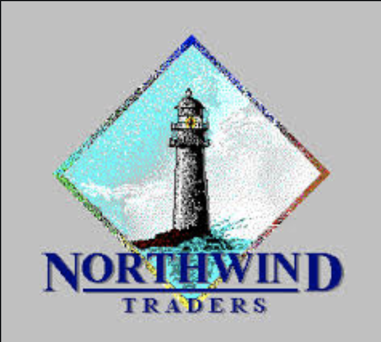
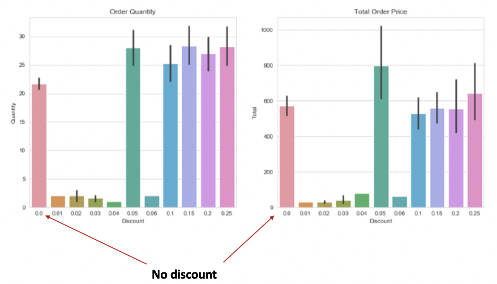
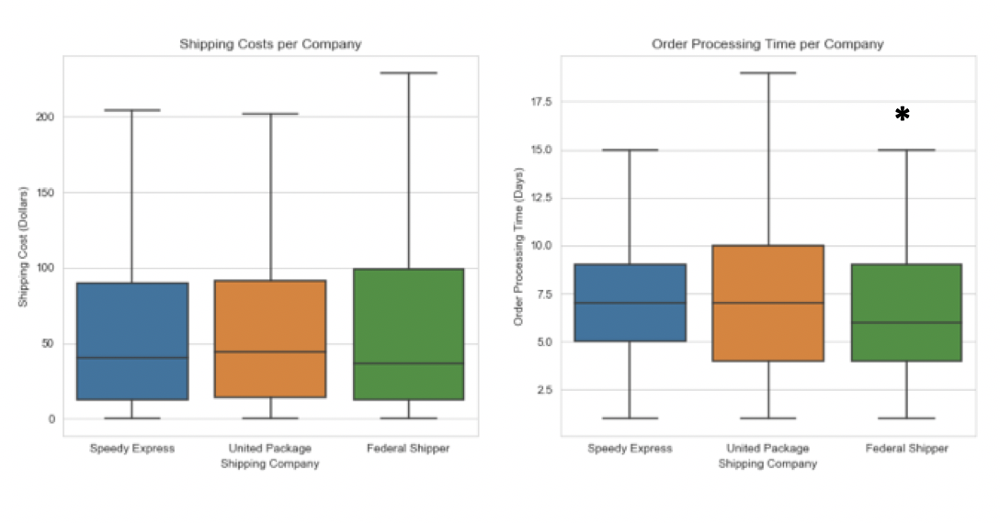
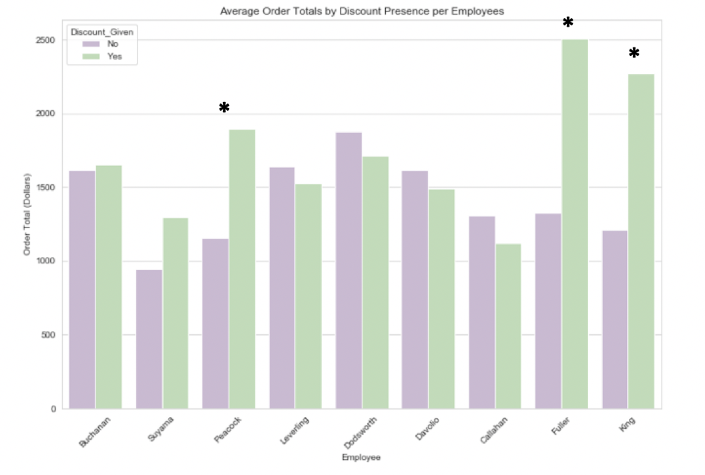

<h1 align="center">Northwind Traders Business Analytics</h1>

## Assessment of Northwind Trading Company

The aim of this project was to evaluate the overall health of the business practices and logistics of the fictitious Northwind Trading Company on several fronts. First, the effectiveness of discounts in encouraging larger quantity orders and higher total order prices was examined. Additionally, customer contact types were evaluated to determine if certain types of contacts place larger orders with the company, and thus suggest that similar types of contacts should be sought within prospective customer companies. Reaching out to a customer and finalizing a sale is meaningless if Northwind is failing logistically to get the product to the customer. For this reason, the cost and speed of shipping was analyzed to determine if improvements could be made to streamline its practice. Lastly, an evaluation of the sales numbers of a sample of employees was used to make recommendations on changes to current training protocols in an effort increase productivity.

The data used during this project came from a sample of 830 customer purchasing orders between 7/4/2012 and 5/6/2014. These were analyzed for trends and significance via statistical hypothesis testing and the appropriate tests for each analysis were selected based on a strict definition of parametric data. The term parametric , and its opposite non-parametric, simply refers to the shape of the data distribution; whereby parametric data resemble the shape of a bell with the majority of the values clustering around the average value of the sample and non-parametric data resemble shapes that deviate from this normal bell curve. This decision was made to ensure the assumptions of each test were satisfied, thereby adding confidence to the actual significance of each result. Additionally, because this decision to strictly adhere to the assumptions for parametric testing eliminated the use of some of the more robust statistical tests, each test was triple checked by three different non-parametric methods: the Kolmogorov-Smirnov test, the Mann-Whitney U test, and the Kruskal-Wallis test.

## Discounts

The initial task was to determine if discounts increase order quantity, and if so, at what level of discount is the effect observed. The chart on the left of the figure above displays the average quantity of orders at the various levels of applied discounts. The average quantity of non-discounted orders is represented by the pink bar on the far left of the chart. Statistical testing suggests that discounted orders had significantly higher quantities than non-discounted orders and that 25% discounts have the greatest effect on increasing order quantity over non-discounted orders. 

The chart on the right of the figure above displays the average total of orders at the various levels of applied discounts. Again, the pink bar on the far left of the chart represents non-discounted orders. Statistical testing suggests that discounted orders had significantly higher order totals than non-discounted orders and that the 5% discount level (which includes discounts between 1% and 5%) had the strongest effect on increasing order totals over non-discounted orders.

From these results it can be suggested that significantly effect both the order quantity and order price, but to varying degrees. Therefore, if the directive of the discounts is to move larger quantities of products, 25% discounts should be offered to the customer. And if the directive of the discounts is to encourage increased customer spending, then 5% discounts should be offered. It is also important to note that 25% discounts had the second strongest effect on increasing order totals over non-discounted orders. Thus, both directives could be accomplished with the 25% discount.

## Customer Contacts

The next task was to determine if different customer contact types within the corporate hierarchy spend more on orders than others. The aim of this analysis was to help Northwind Traders target specific contacts within prospective customer companies that statistically have higher purchase order totals. There was a wide range of orders made by each contact title (7 orders made by Owner/Marketing Assistant to 160 orders made by Sales Representatives), thus the different contact titles were logically grouped by suspected corporate level into four groups of relatively equal sample sizes (Owners, Management, Representative and Agents, and Assistants and Admins). Pairwise comparisons were made between the distribution of order totals for each contact type and it was found that there was no significant difference. While these findings suggest that no recommendation can be made in terms of customer contact types to target for sales, the results do suggest that simply establishing a customer contact, regardless of title, is positive in terms of potential sales.

## Shipping

A thorough analysis of the Northwind Traders shipping department was conducted with the aim evaluating the performance and costs of the three companies (Speedy Express, United Package, and Federal Package) on contract. Pairwise comparisons between the distribution of shipping costs for the three companies was performed. The chart on the left of the figure above displays the distribution of shipping cost and the chart on the right displays the distribution of order processing times for each company. While there was no significant difference found between the shipping costs of the three companies, Federal Shipper had significantly shorter order processing times than the other two companies. Additionally, there were no significant differences in the processing times based on shipment size. Thus, if speed of delivery is the primary concern, Federal Shipper should be selected as the exclusive shipping company as it has significantly shorter processing times and does not differ significantly in terms of cost with the other two companies.

However, when shipping costs were evaluated by delivery region (figure displayed below), Federal Shipper had the greatest number of significant cost differences between the regional comparisons and United Package had the fewest number of significant cost differences. Therefore, if annual shipping costs are difficult to predict (and therefore budget appropriately) while utilizing three companies, Northwind Traders should consider using  United Package exclusively as their shipping company because its overall shipping costs do not differ significantly from the other two companies and because its regional shipping costs are the most uniform.

## Employee Sales Performance

Lastly, the sales performance of the nine employees in the sample were evaluated in an attempt to discover any traits of high-earning employees that could be incorporated into training protocols. The distribution of order totals were compared pairwise for each employee and only two comparisons were found to be significantly different out of 35 possible comparisons, each with relatively small effect sizes (0.28 and 0.29). Additionally, when the employees were grouped into young, middle age, and relatively old based on their stated birthdate and the date of this project (4/5/19), there was no significant difference between order totals of each age group. These results suggest assumed sales experience does not effect employee sales performance. 

Finally, each employee’s order totals were compared between discounted and non-discounted orders to determine if discounts can be offered strategically to encourage increased customer spending. These tests found that three of the nine employees in the sample had significantly higher order totals on discounted orders than on non-discounted orders. Employee training protocols could be modified to educate employees of the effects of discounts found during this project and how they can be applied to increase customer spending.

## Conclusion

The results from this project produced multiple business recommendations for improving Northwind Traders. First, discounts significantly increase both order quantity and order total. The results suggest offering 25% discounts to increase the quantity of items sold in an order and to offer a 5% discount to increase the order total. Second, because there was no difference found between the order totals of the four customer contact groups, employees should be encouraged to establish whatever contact they can with a respective client and not to focus on the particular position the customer contact holds within their company. Third, because there was no significant difference found between the overall shipping costs of the three companies on contract, Federal Shipper should be considered for most shipments as it had significantly shorter processing times than the other two companies. However, if shipping costs are difficult to budget for using three companies, United Package should be considered as the exclusive shipping company as its regional shipping costs were the most uniform. Lastly, employee training protocols should be updated to educate current and new employees on the effects of discounts found in this project and how discounts can be used strategically to increase sales numbers.

